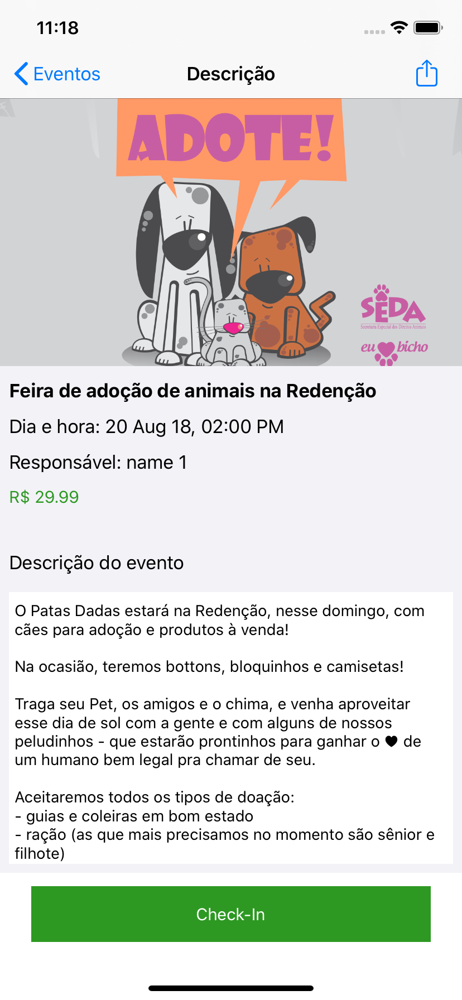
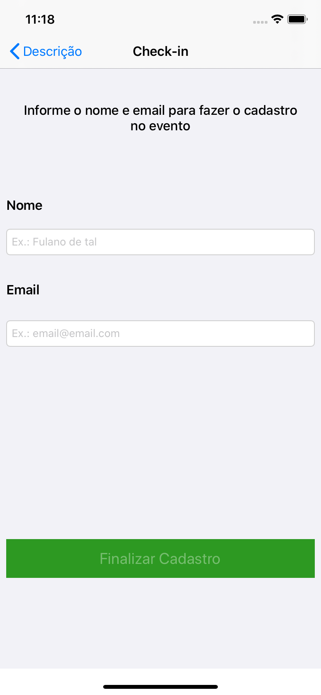

# App-Eventos
É um App que exibe uma lista de eventos que foram obtidos de uma REST API, sendo possível ver os detalhes do mesmo e fazer check-in.

## Definições do projeto:
* Utilizado a arquitetura MVVM.
* RxSwift.
* A biblioteca Alamofire para a requisição dos dados.
* Para serialização de dados foi utilizado o Codable.
* Para os testes de rede foi utilizado o OHHTTPStubs e para os demais testes foi utilizado XCTest.

## Características:
- O App possui layout responsivo para os diferentes tamanhos de tela.
- Tratamento de possíveis erros de rede.
- Valida as informações do nome e email se podem ser válidos, e se forem o botão de check-in fica disponível para click.

## Capturas de tela
* A primeira tela mostra uma lista de eventos com imagem, título, nome do responsável, dia e hora que vai ocorrer.
---
<h1 align="center">

</h1>

* Na segunda tela mostra os detalhes do evento: nome, dia e hora, nome do responsável, valor, descrição, um botão para compartilhar e um botão para fazer o check-in.
<h2 align="center">

</h2>

* A terceira tela é utilizada para fazer o check-in no evento.
<h2 align="center">

</h2>

## 🔖 API
https://5b840ba5db24a100142dcd8c.mockapi.io/api/events

## 📧 Contact

- Email at weberecomp@gmail.com

## 📝 License

This project is licensed under the MIT License - see the [LICENSE](LICENSE) file for details.
